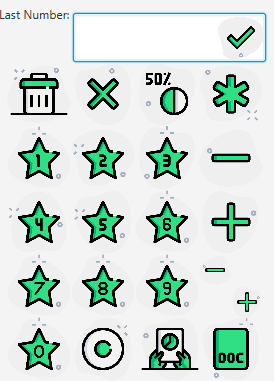
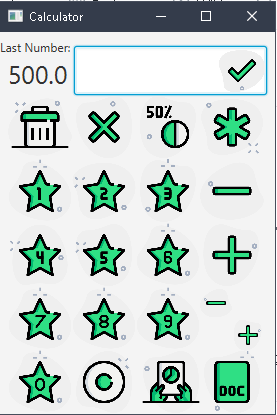

# SimpleCalculator
My calculator with some improvements that make your calculator a clean design rather than windows default
Icons made by [Pixel Perfect](https://www.flaticon.com/authors/pixel-perfect) from [Flat Icon](https://www.flaticon.com/)
## What I Made
* Put buttons to type numbers and make them work
* Put buttons to type symbols and make them work
* Make an equal button
* Make a system of last number
* Make a system of history, its in the results.txt, just open the jar with winrar or 7-zip and open results.txt, sorry didnt make a system for that.
* Make letters bigger
* Remove old icons and put new icons
* And continue to improve with some recomendations from friends or even you who is reading.
## Contact
I´m available from 1pm to 7pm. but just for talking i´m available from 10am to 8pm.
i will make all suggestion that i can. because i dont know that much of java, not an expert, nor an begginer.
If you download i will be glad only because someone rather than my parents are interested, i know that a calculator is not that thing, but it was hard to make.
## Screenshots

